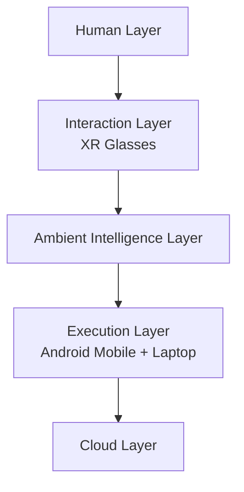

# Platform architecture

## Purpose

This document defines the high-level architecture of the Starlight Platform as a layered computing system. The architecture separates human interaction, ambient intelligence, execution, and cloud services so that each layer can evolve independently while maintaining a consistent system boundary.

## Architectural layers

The platform is organized into five layers:

1. Human Layer: the user’s goals, preferences, attention, and decision authority.
2. Interaction Layer: XR glasses and related input/output surfaces.
3. Ambient Intelligence Layer: context interpretation, planning, and coordination.
4. Execution Layer: Android mobile and laptop workstations for task execution.
5. Cloud Layer: shared state, archival storage, and cross-device continuity.

## System responsibilities

- The Human Layer supplies goals, consent, preferences, and priorities.
- The Interaction Layer provides low-friction capture and presentation of information.
- The Ambient Intelligence Layer performs interpretation, planning, and coordination.
- The Execution Layer carries out tasks suited to each device class.
- The Cloud Layer provides durable storage, synchronization, and shared context.

## Architectural objectives

The platform is intended to support continuity of activity across devices while minimizing unnecessary user intervention. The architecture therefore emphasizes explicit state handoff, clear responsibility boundaries, and graceful degradation when a device or connection is unavailable.

## Interface boundaries

Each layer exposes a narrow set of interfaces to adjacent layers. The Interaction Layer communicates intent and observable context to the Ambient Intelligence Layer. The Ambient Intelligence Layer issues execution requests to the Execution Layer and persistence requests to the Cloud Layer. These boundaries are designed to preserve modularity and reduce coupling between subsystems.

## Non-functional requirements

The architecture must preserve privacy, tolerate device asymmetry, and support staged deployment. It should also remain compatible with existing hardware in the near term while leaving room for future specialized systems.

## Cross references

- See [docs/00-platform-manifesto.md](../docs/00-platform-manifesto.md) for the conceptual framing.
- See [docs/04-system-overview.md](../docs/04-system-overview.md) for the platform overview.
