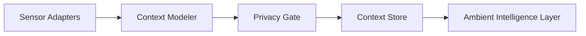

# Context and sensing architecture

## Purpose

This document describes the subsystem responsible for sensing context, interpreting environmental state, and preparing structured representations for higher-level reasoning.

## Responsibilities

The context and sensing subsystem collects and normalizes signals from devices and user contexts. It converts raw observations into structured context objects that can be consumed by planning and orchestration services.

## Core components

- Sensor adapters: unify data from glasses, mobile, laptop, and cloud-connected services.
- Context modeler: translate device and environmental signals into a common abstraction.
- Privacy gate: enforce retention, purpose, and visibility rules for each signal.
- Context store: maintain short-lived and durable context objects with clear lifecycle boundaries.

## Interaction model

The subsystem does not make decisions on its own. It provides context representations that allow higher-level components to reason about timing, location, activity, and user intent. This separation is important because sensing is a supporting service rather than a policy authority.

## Cross references

- See [docs/14-privacy-and-safety.md](../docs/14-privacy-and-safety.md) for privacy constraints.
- See [docs/08-device-orchestration.md](../docs/08-device-orchestration.md) for coordination patterns.
