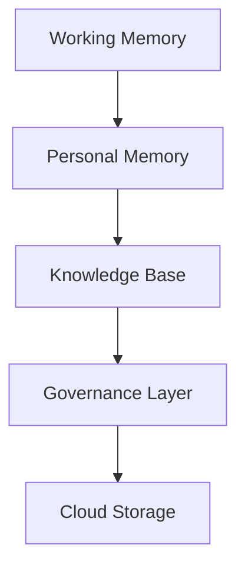

# Data and memory architecture

## Purpose

This document describes the data and memory architecture for the Starlight Platform. It defines how context, knowledge, and user history are represented, stored, and governed across devices and services.

## Responsibilities

The memory architecture supports retrieval, persistence, and curation of information needed for assistance. It must distinguish between ephemeral context, durable memory, and external knowledge sources.

## Core components

- Working memory: transient context for the current task or session.
- Personal memory: user-specific history and preferences.
- Knowledge base: structured records from documents, notes, and prior sessions.
- Governance layer: rules for retention, access, sharing, and deletion.

## Design considerations

The architecture must support local-first operation where possible, while still allowing cross-device continuity and optional cloud persistence. Memory should be reviewable and controllable by the user.

## Cross references

- See [docs/14-privacy-and-safety.md](../docs/14-privacy-and-safety.md) for governance and trust requirements.
- See [docs/20-research-intelligence.md](../docs/20-research-intelligence.md) for research-oriented memory use cases.
