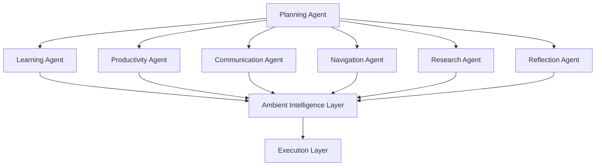
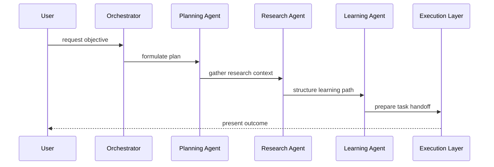

# Agent architecture

## Purpose

This document defines the multi-agent architecture for the Starlight Platform. The architecture treats agents as specialized reasoning and coordination subsystems that operate within a shared ambient environment rather than as isolated applications.

## Agent roles

- Planning Agent: translates goals into actionable sequences and dependencies.
- Learning Agent: structures study material, suggests review cycles, and supports comprehension.
- Productivity Agent: manages task capture, follow-up, and workflow continuity.
- Communication Agent: prepares summaries, drafts, and message workflows for user review.
- Navigation Agent: aligns route guidance, reminders, and situational awareness with current context.
- Research Agent: coordinates literature review, note synthesis, and experiment planning.
- Reflection Agent: supports optional journaling, review, and calm interaction patterns.

## Architectural model

Each agent exposes a small interface for receiving context, producing recommendations, and handing work to other agents or devices. Orchestration occurs through the ambient intelligence layer rather than through direct agent-to-agent coupling.

## Interface contract

Agents operate through a common context model that includes intent, task state, device constraints, and user preferences. The contract is intentionally narrow so each agent can remain focused on its domain while still participating in a coordinated system.

## Coordination model

The orchestrator routes requests to the appropriate specialist based on task type, urgency, and available device context. This keeps the system modular while avoiding unnecessary coordination overhead.

## Observability and safety

Each agent should produce reviewable outputs, maintain transparent reasoning boundaries, and defer to the user when confidence is low or the request affects sensitive areas. This is especially important for reflection, health-related routines, and research activities.

## Design principles

- Agents should be specialized rather than omniscient.
- Communication should be based on shared context and explicit handoff.
- Each agent should remain observable and reviewable by the user.
- The system should preserve user control over actions and recommendations.

## Cross references

- See [docs/07-ai-architecture.md](../docs/07-ai-architecture.md) for the AI architecture perspective.
- See [architecture/03-runtime-orchestration.md](03-runtime-orchestration.md) for orchestration semantics.
