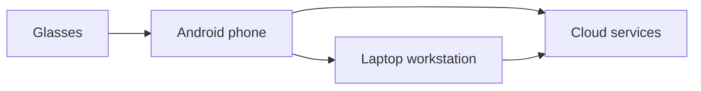

# Vision

## Purpose
Starlight is a research platform for ambient intelligence. It is not framed as a single consumer product, but as a broader platform investigation into how computing can better support human attention and activity across devices.

## Naming
The repository and platform are named Starlight. "Project Divine Connect" is retained as a working codename for the first product concept that may emerge from this research direction.

## Background
Modern computing increasingly fragments attention across notifications, applications, meetings, and devices. The opportunity is to reduce that burden by creating systems that coordinate work in the background, present concise assistance when useful, and remain under user control.

## Research focus
Starlight explores how XR smart glasses can serve as a primary human interface, while Android mobile devices, laptop workstations, and cloud services provide execution, context, and continuity. The objective is not to maximize engagement, but to reduce the effort required to move between tasks and information.

## Platform proposition
The work investigates a computing model in which:
- the system understands context,
- the user is not required to manage every handoff manually,
- tasks are routed to the device best suited for the job,
- assistance is transparent, configurable, and privacy-preserving.

## Platform goals
1. Reduce cognitive load.
2. Lower friction in cross-device workflows.
3. Support learning, work, navigation, and routine management.
4. Preserve user agency and transparent control.
5. Create a realistic path from current devices to more specialized future hardware.

## Research layers
- Today: prototype the interaction model with existing XR-capable devices and companion applications.
- Research: study multimodal context awareness, memory, orchestration, and personalization.
- Vision: define a longer-term path toward reference hardware and platform-level customization.

A useful mental model is a layered stack in which sensing and capture happen at the edge, orchestration and task handling run on Android mobile, deeper work is completed on the laptop, and cloud services support continuity and sync.

## Working principles
- Human agency comes first.
- Assistance should be timely without being intrusive.
- Privacy and transparency are design requirements.
- The system should explain its suggestions and allow them to be reviewed or ignored.

## Looking ahead
Starlight is intended as a long-range research platform for ambient computing, human-centered AI, XR interfaces, and cross-device systems. Its value will be judged by whether it helps people spend less time managing technology and more time on learning, work, relationships, and other priorities.

## References
- Android Open Source Project documentation and platform architecture.
- Human-computer interaction and XR research on assistive systems.
- Privacy-preserving design and accessible interface guidance.
