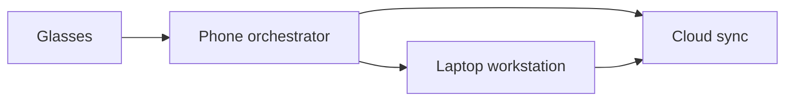

# System overview

## Purpose
This document outlines the high-level structure of the Starlight platform and how its layers should work together.

## Background
A useful ambient intelligence system needs clear boundaries between sensing, reasoning, storage, and action. The Starlight model separates these concerns so the experience can be piloted gradually and evaluated with discipline.

## Goals
- Define the functional roles of glasses, phone, laptop, and cloud.
- Show how the system can support multimodal interaction without becoming overly complex.
- Provide a cohesive frame for the later mode-specific documents.

## System design
The system is organized as a layered architecture:
- Perception layer: capture from microphone, camera, sensors, and user context.
- Coordination layer: Android mobile acts as the orchestrator for tasks, reminders, and handoff.
- Knowledge layer: the laptop provides deeper drafting, analysis, and document work.
- Cloud layer: sync, storage, and cross-device continuity.

## Key workflows
- A user asks for help while walking, studying, or working.
- The phone interprets the request, routes it to the correct service, and returns a response.
- If the task needs deeper work, the laptop becomes the primary execution surface.
- Results are synced back to the cloud and surfaced on the most relevant device.

## Constraints
- The phone should not become a bottleneck for every interaction.
- The glasses experience must remain lightweight so it does not overwhelm the user.
- Some tasks require asynchronous handoff and later completion.

## Future work
Future work should refine the orchestration model around context memory, task state, and adaptive escalation between devices.

## References
- Distributed systems and edge-to-cloud architecture literature.
- Mobile orchestration patterns for AI assistants.
- Human factors research related to situated computing.
