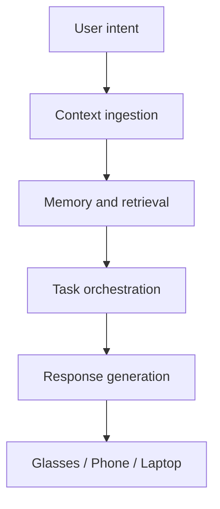

# AI architecture

## Purpose
This document outlines the research-oriented AI architecture for Starlight Platform, focusing on agentic assistance and multimodal understanding without overclaiming existing platform capabilities.

## Background
An ambient assistant becomes useful when it can connect user intent, available context, and device affordances. The architecture should be modular so that different model providers, on-device services, and cloud services can be evaluated over time. In the Today layer, this means starting with practical and explainable assistance. In the Research layer, the goal is to test more capable context memory and more agentic workflows. In the Vision layer, the system can become more specialized and deeply integrated.

## Goals
- Define how the assistant can understand user intent across modalities.
- Separate context retrieval, orchestration, and content generation responsibilities.
- Support a staged path from simple prompts to richer agentic workflows.

## Research access layer

Starlight Platform includes a research access layer that helps users learn, practice, and investigate topics by connecting to approved research ecosystems such as:

- Google Research
- DeepMind
- Google Labs
- Google Quantum AI
- IBM Qiskit
- user-approved document collections
- notebook-based research workflows

The system does not bypass access controls. It operates only through user permissions, public resources, or authorized integrations. Its role is to orchestrate research activity by searching approved sources, summarizing relevant material, organizing notes, supporting experiments, and routing work to the appropriate workflow.

## System design
The proposed AI architecture has four parts:
- Perception and context ingestion: speech, text, images, location, calendar, and task state.
- Memory and retrieval: local and cloud-backed context memory with user control over retention.
- Planning and task orchestration: routing tasks to the best device and selecting the right response format.
- Response generation: summaries, drafts, reminders, or suggestions delivered in the appropriate modality.

These subsystems are intended to operate as a shared reasoning stack rather than as a single monolithic assistant. This separation enables staged deployment, easier evaluation, and clearer boundaries between sensing, retrieval, and response generation.

## Key workflows
- Ask for a summary of a lecture, calendar, or task list.
- Generate a draft email or study plan from captured context.
- Convert a spoken reminder into a scheduled task with appropriate follow-up.

## Constraints
- Model quality, latency, cost, and privacy tradeoffs all matter.
- The system should avoid assuming that all sensing or inference can run fully on device.
- The assistant should be transparent about uncertainty and defer to the user when needed.

## Future work
Future work should investigate long-context memory, multimodal capture, personalization, and better evaluation of agent reliability in everyday settings.

## References
- Agentic AI research and planning literature.
- Retrieval-augmented generation and context management studies.
- Multimodal interaction and embodied AI references.
