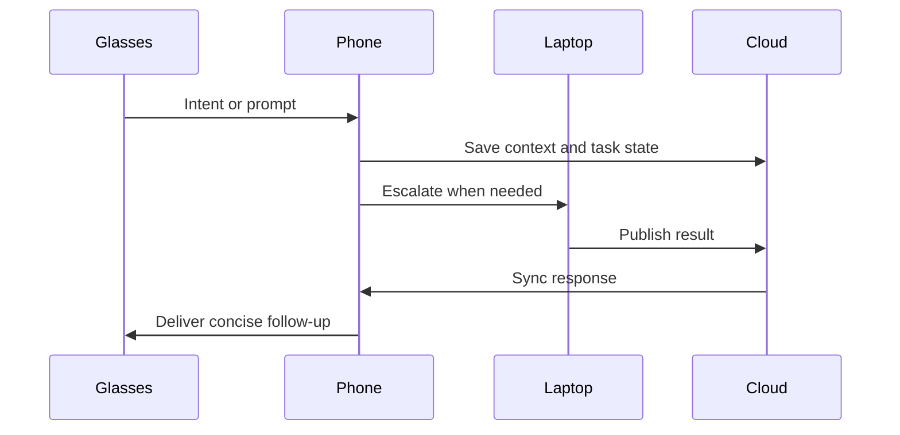

# Device orchestration

## Purpose
This document describes how Starlight should coordinate activity across glasses, phone, laptop, and cloud so the experience feels continuous and low-friction.

## Background
Cross-device orchestration is one of the core differentiators of the platform. A useful assistant must know when to respond on the glasses, when to defer to the phone, and when to escalate to the laptop. This capability is foundational for the Today layer, where a prototype must feel coherent across devices, and it becomes more sophisticated as the Research and Vision layers mature.

## Goals
- Define handoff patterns for reminders, summaries, drafting, and task execution.
- Show how context can flow across devices without forcing the user to re-enter information.
- Keep the experience calm and predictable.

## System design
The orchestration model should be event-driven and context-aware:
- Immediate needs: glasses and phone handle short prompts, reminders, and quick summaries.
- Deeper work: laptop handles drafting, analysis, and longer reading or editing.
- Sync and continuity: cloud stores task state and selected context for later retrieval.

## Key workflows
- A reminder created on the phone becomes visible on the glasses at the appropriate moment.
- A note captured during a walk can later become a richer draft on the laptop.
- A study task started on the phone can be resumed on the laptop without losing state.

## Constraints
- Network quality and device availability affect orchestration.
- Hand-off rules should be explainable and controllable by the user.
- Some contexts should not be automatically shared across devices without consent.

## Future work
Future work should define the task state model, context retention policy, and adaptive routing logic for different situations.

## References
- Cross-device UX and continuity research.
- Task handoff and context management studies.
- Mobile and wearable orchestration frameworks.
