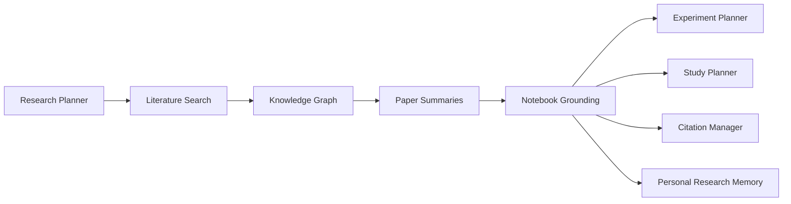

# Research intelligence

## Purpose

The Research Intelligence Engine is a subsystem for learning, investigation, and knowledge work. It coordinates user-approved materials and trusted external knowledge sources so that research activities can proceed in a structured and permission-based manner.

## Scope

This engine supports the planning, discovery, organization, and synthesis of research work. It is not intended to bypass access controls or imply unrestricted access to proprietary systems. Instead, it operates over publicly available material, user-authorized collections, and approved integrations.

## Architecture overview

The architecture is organized around a set of cooperating subsystems:

- Research Planner: converts a question or objective into a sequence of study and investigation steps.
- Literature Search: identifies candidate sources from approved repositories and public knowledge ecosystems.
- Knowledge Graph: organizes concepts, claims, entities, and relationships across collected materials.
- Notebook grounding: ties extracted insights to structured notes and research notebooks.
- Paper Summaries: produces concise, attributable summaries for review.
- Experiment Planner: translates research questions into hypotheses, materials, and study steps.
- Study Planner: converts a topic into a learning path with milestones and checkpoints.
- Citation Manager: tracks references, provenance, and attribution.
- Personal Research Memory: maintains a user-specific record of prior work, preferences, and progress.

## Supported knowledge sources

The engine can work with public and user-authorized research ecosystems such as:

- Google Research publications
- DeepMind publications
- Google Labs experiments
- Google Quantum AI educational resources
- IBM Quantum and Qiskit documentation
- user-approved document collections
- notebook-based research workflows

These examples are treated as supported knowledge sources where the user has access or where content is publicly available. The architecture does not assume unrestricted access to private or licensed materials.

## Operational model

The engine proceeds through three stages:

1. Discovery: identify candidate sources and relevant materials.
2. Synthesis: extract structure, summarize findings, and relate them to prior work.
3. Application: convert the synthesized knowledge into study plans, experiment notes, or research artifacts.

## Interaction with the platform

Research Intelligence is a specialist subsystem within the broader Starlight Platform. It interfaces with the Ambient Intelligence layer for context, the Execution layer for task handoff, and the Cloud layer for shared notes and persistence. It is designed to support learning and investigation without replacing the user’s agency or judgment.

## Conclusion

The Research Intelligence Engine provides a disciplined architecture for research assistance. Its value lies in coordinating trusted knowledge sources, organizing evidence, and translating information into structured work products.
