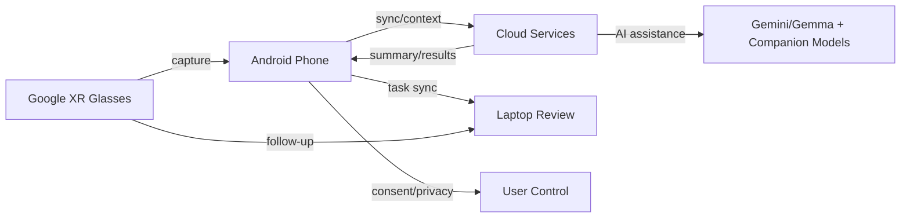

# Architecture diagram

## Purpose
This document describes the core architecture flow for the Starlight prototype and includes a visual diagram.

## Architecture flow
- XR glasses capture audio, commands, and context.
- Android phone receives the capture, manages privacy, and orchestrates next steps.
- Cloud services perform AI-driven summarization, research refinement, and state sync.
- Laptop provides a deeper review surface and task continuation environment.

## Visual diagram
